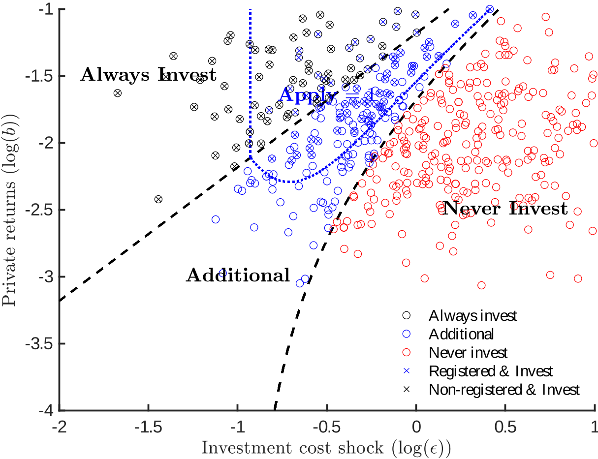

## **Summary**

### **1. Overview of the Offset Market Setup**

I find this paper informative and enjoyable to read. It provides valuable insights into the *supply side* of the carbon-offset market, *How are offset products generated by firms?* In particular, the paper looks at manufacturing firms in China that invest in projects to abate the pollution or emissions stemming from their production. These abatement activities can then generate offset credits (upon approval of the authority), which other regulated firms (often in more heavily regulated regions) can buy to fulfill their own pollution control obligations. 

- The offset market in question is *artificially created* by an international agreement (e.g., “Kyoto Protocal” or "Paris Acord"). Absent this agreement, there would be neither demand nor supply for such offsets.
- This leads to the idea that a third-party entity (the “market maker” or the *CDM Board*) must ensure *quality control* of the offsets. The Board’s role is to verify and register only those projects that are “additional,” i.e., genuinely unprofitable without offset revenue.  
- In economic terms, each offset unit must have a non-zero marginal cost of production; otherwise, these projects would have been undertaken anyway and thus do not represent new emissions reductions.

Effectively, the Board’s screening process aims to certify only those projects with a real abatement cost—thus upholding the *additionality* condition. The paper sets up a *joint* model of (i) firms’ **investment decisions** and **applying decisions** on these offset-supplying projects and (ii) the Board’s choice of which projects to **approve**.

---

### **2. The Core Paradox: Registered Firms Have *Higher* Emissions** 
An interesting, even paradoxical, empirical finding is that firms which successfully register a CDM project end up *increasing* their total emissions relative to **comparable** firms that do not register or do not propose a project. At first glance, one might expect abatement projects to reduce emissions, not to coincide with higher pollution. The authors highlight three channels that reconcile this seeming contradiction:

1. **Growth Effect (Self-Selection)**  
   Firms that find abatement investments more attractive are those that (1) have low cost (high static return) in pollution reduction (2) have medium cost in abatement but anticipate growth in output, therefore have high **future** profit to cover their not-so-low investment cost. Hence, firms have different investment motives.

2. **Growth Effect (External Screening)**  
   The CDM Board only screens out projects with low investment cost, (high static return). It does *not* filter out firms expecting high *future* return. Consequently, the set of *registered* projects are mainly composed of median-cost firms that expects growth.

3. **Productivity Effect**  
   Projects that improve emissions efficiency often raise overall productivity. Higher overall productivity in turn leads the firm to optimally choose higher production levels. The net result can be an overall increase in total emissions, even if emissions *per unit output* are constant or slightly improved.

---
## **Comments**
### **Empirical results**
- The estimation of treatment effect is quite robust. I would like to see a bit more discussion on the construction of the controls (e.g., variables that are used to calculate the distance) and graphical illustration on the validity of controls. 
- The authors caution that the treatment effect estimation from their regression should not be interpreted as causal because of firms' anticipation. Here, is "no anticipation" the same as "no self-selection"? I thought selection and anticipation are two distinct issues with the use of event study regression.

   > For this reason, we believe that firms may select into the CDM based on their own anticipated growth, which would violate the "no anticipation" assumption required to interpret an event-study estimate as the causal effect of a dynamic treatment.

- Now that the estimates is a combination of 3 forces. (1) the true emission efficiency reduction (2) growth effect (selection) (3) productivity effect. A succesful treatment effect estimation should isolate (1) from the rest of two **if** there is good control group. The empirical results state that we do not get (1) because it is contaminated by (2) and (3). Yet how do we recover (1) is still of question because it seems that the model seems to deal with the disentanglement of (2) and (3). 

### **Model**
I like the model which is simple to set up and capture the key issues of self-selection, external screening and productivity change.

- The objective of the model is to isolate the (2) and (3) where (2) can be further decomposed into two types of selection. In terms of force (2), the most insightful takeaway is the follwoing figure. It nicely illustrates firms applying and investing decision as well as the effect of board's screening criteria on the firms' decsion.

- It seems that the model already assumes that those projects are effective in increasing emission efficiency $z^e$, that is to say force (1) is significantly positive. However whether all abatement investment project has positive $\delta z^e$ is an empirical question and hasn't been solved in the previous section.
- What is the board objective? Given a pool of projects, one clear objective is that the board wants to maximize the share of additional projects out of all approved projects. Since the board has incomplete information on the firms, it bases its decision on **declared cost of investment**, equivalently the internal rate of return. The model shows that varying this threshold doesn't change the share of additionality. Therefore, the ratio of granted CERs over actual additional abatement remains almost constant regardless of the threshold. The threshold only changes the total amount of abatement projects but not the share of additionality. Could it be the case that the board also wants to maximize the total number of abatement projects, including additional and non additional ones? What can the board do to balance these two objectives (additionality and total number)? What instruments does the board have to change the incentive of investing (I guess the price of CERs, but this is out of the board's control) and applying (cost threhold in approval)?
- It would be interesting to show comparative statics in (1) changing cost threshold in approval and (2) changing the price of CERs. My guess is the following. 

### **Estimation**

- The identification argument is presented graphically. I think this is not rigorous enough but in moment methods, identification is always hard to justified. I will sleep on this because I am not familiar with it either.
- The parameter estimates shows that the paradox can be mostly attributed to the selection issue (force (2)) rather than the productivity (force (3)). What is the main parameter that drives this result?

### **Conclusion**

- The term selection can be understood from two perspectives.
  - Adverse selection: Though athority has almost perfect information on baseline emission, output etc. It is still ignorant to the firm's productivity growth which is firms' private information. As long as the private information persists, it can not perfectly select projects that are addtional, which leads to adverse selection problem. 
  - Selection issue in treatment effect estimation: when economist tries to estimate treatment effect, selection into treatment poses a problem. Here, in this context, there are two contaminating selection, self-selection into treatment as well as external screening by the board. 
The empirical section admits that what we observe/estimate is contaminate but does not deal with it. The model section looks into the contamination and models the contribution of each forces of bias.

- I think it would be interesting to resort to the literature on adverse selection/screeing. What can the board do to achieve better outcome, first/second/third best efficiency? 
