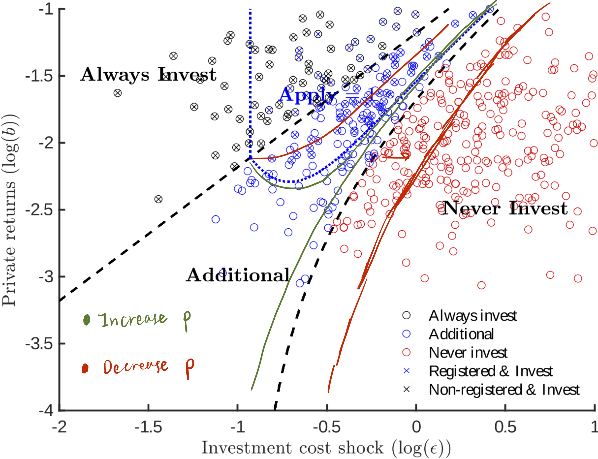

## **Summary**

### **1. Overview of the Offset Market Setup**

I find this paper informative and enjoyable to read. It provides valuable insights into the *supply side* of the carbon-offset market, asking: *How are offset products generated by firms?* In particular, the paper focuses on manufacturing firms in China that invest in projects to abate the pollution or emissions resulting from their production. These abatement activities can generate offset credits (upon approval by an authority), which other regulated firms (often in more heavily regulated regions) can buy to fulfill their own pollution control obligations. 

- The offset market in question is *artificially created* by international agreements (e.g., the “Kyoto Protocol” or the “Paris Accord”). Absent these agreements, there would be neither demand nor supply for such offsets.
- This necessitates a third-party entity (the “market maker” or the *CDM Board*) to ensure *quality control* of the offsets. The Board’s role is to verify and register only those projects that are “additional,” i.e., genuinely unprofitable without offset revenue.  
- In economic terms, each offset unit must have a non-zero marginal cost of production; otherwise, the projects would have been undertaken anyway and thus do not represent genuine emissions reductions.

Effectively, the Board’s screening process aims to certify only those projects with a real abatement cost—thus upholding the *additionality* condition. The paper sets up a *joint* model of (i) firms’ **investment and application decisions** on these offset-supplying projects and (ii) the Board’s **approval decision**.

---

### **2. The Core Paradox: Registered Firms Have *Higher* Emissions**

An interesting—and seemingly paradoxical—empirical finding is that firms which successfully register a CDM project end up *increasing* their total emissions relative to **comparable** firms that do not register or do not propose a project. At first glance, one would expect abatement projects to reduce emissions, not coincide with higher pollution. The authors highlight three mechanisms that help reconcile this apparent contradiction:
1. **Emission efficiency change (Actual abatement outcome)**

2.  Growth effect
    1.  **Self-Selection**  
   Firms that find abatement investments attractive are either: (1) low-cost firms with high static returns to pollution reduction, or (2) medium-cost firms that anticipate future growth, and thus expect high future profits to justify the investment. Firms, therefore, have different investment motives, depending on both costs and expected future output.

    2. **External Screening**  
   The CDM Board screens out projects with high static returns (i.e., low-cost investments) but cannot observe future returns. As a result, the projects that pass the screen tend to be submitted by medium-cost firms that expect future growth.

3. **Productivity Effect**  
   Projects that improve emissions efficiency often raise overall productivity. Higher productivity, in turn, leads firms to optimally increase production levels. The result can be an increase in total emissions, even if emissions *per unit of output* remain constant or decrease slightly.

---

## **Comments**

### **Empirical Results**

- The estimation of the treatment effect is quite robust. However, I would appreciate more discussion on how the control group was constructed (e.g., variables used to calculate distance) and some graphical illustration supporting the validity of the control group.  
- The authors note that the treatment effect from their regressions should not be interpreted causally due to firms' anticipation. Here, is the "no anticipation" assumption the same as "no self-selection"? I would think that selection and anticipation are conceptually distinct issues in the context of event study regressions.

   > For this reason, we believe that firms may select into the CDM based on their own anticipated growth, which would violate the "no anticipation" assumption required to interpret an event-study estimate as the causal effect of a dynamic treatment.

- Given that the estimate is a mixture of three forces: (1) true emissions efficiency gain, (2) selection (growth effect), and (3) productivity-induced scale effect, a successful treatment-effect estimation should aim to isolate (1) from the others—assuming a good control group. The empirical results suggest that we do not successfully identify (1), as it is contaminated by (2) and (3). Yet how to recover (1) remains an open question. It seems the model mainly disentangles (2) from (3), rather than targeting (1).

### **Model**

I like the model—it is simple to set up and effectively captures the key issues: self-selection, external screening, and productivity effects.

- The model's objective is to disentangle forces (2) and (3), where (2) itself can be decomposed into different types of selection (2.1 & 2.2). One of the most insightful takeaways is Figure 8, which nicely illustrates firms’ investment and application decisions, as well as the effects of the Board's screening criteria on firm behavior.

- It seems the model assumes that projects increase emissions efficiency $z^e$—that is, force (1) is positive. However, whether all abatement investments genuinely increase $z^e$ is an empirical question that remains unaddressed in the empirical section.
- What is the Board's objective? A clear candidate is to maximize the share of additional projects among approved projects. Since the Board has incomplete information, it bases its decision on the declared investment cost (equivalently, internal rate of return). The model shows that tightening the threshold does not improve this share. In other words, the ratio of granted CERs to actual additional abatement is nearly invariant to the threshold. Could it be that the Board also wants to maximize the *total number* of projects (not just the share that is additional)? What trade-off does the Board face between these two objectives? What policy tools does it have to manage this—beyond the cost threshold in approvals? Can it influence the incentive to invest (perhaps through the CER price, although that may be beyond its control) or the incentive to apply?

- It would be interesting to show comparative statics with respect to (a) changing the approval threshold and (b) changing the CER price. My guess is the following:
  
  
  

### **Estimation**

- The identification argument is presented graphically. While this is intuitive, it may not be rigorous enough. Of course, identification is often difficult to justify cleanly in method-of-moments settings, but a deeper discussion would help. I’ll continue thinking about this since I’m not fully familiar with the relevant estimation literature.
- The parameter estimates suggest that most of the observed emissions growth is due to selection (force 2), rather than productivity-induced expansion (force 3). Which parameter(s) in the model drive this result most strongly?

---

### **Conclusion**

The term “selection” appears in two contexts:

- **Adverse selection**: Although the authority has nearly complete information on baseline emissions and output, it lacks knowledge of firms’ productivity growth, which remains private. As long as this private information persists, the Board cannot perfectly identify truly additional projects, leading to adverse selection.
  
- **Selection in treatment-effect estimation**: When estimating the treatment effect of project registration, selection into treatment (via both self-selection and Board screening) complicates identification. The empirical section acknowledges that treatment effects are contaminated by these selection effects but does not attempt to address them directly. The model steps in to decompose the contribution of each source of bias.

Lastly, I think it would be fruitful to further connect this analysis to the broader literature on adverse selection and screening. What can the Board do to improve outcomes—achieving first-, second-, or third-best efficiency? Are there alternative screening mechanisms or policy tools that could help mitigate the selection problem?
